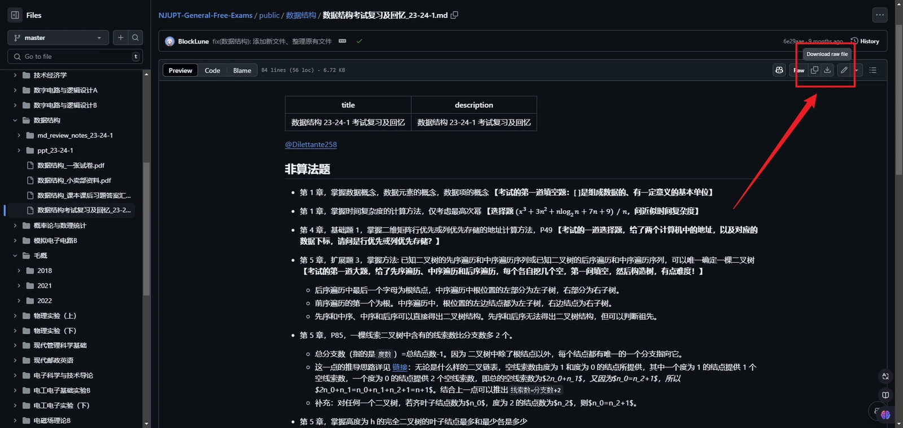

本文介绍了如何在本项目中检索资料，以及如何下载这些资料。

## 检查网络连接

由于我们的资料仓库都位于 GitHub 上，所以您必须确保您能够访问 GitHub。为此，您可以尝试以下方法：

- 使用 **代理**（最为推荐的方法）
- 使用 [Watt Toolkit](https://steampp.net/) 本地反向代理加速 GitHub（操作见下图）
- 修改 hosts 文件（参考：[解决 GitHub 的 host 域名被限制的问题](https://iphysresearch.github.io/blog/post/programing/linux_shell/hosts/)）

## 检索资料

除了通识课资料仓库外，到目前为止，其他资料仓库并未建立门户网站。这些未建立门户网站的资料仓库的目录结构相对简单，直接进入检索即可。

对于[通识课资料仓库](https://github.com/NJUPTFreeExams/NJUPT-General-Free-Exams)，由于此门户网站的建立，目录结构更为复杂。这是由于门户网站的网站代码也存储在了此仓库中。有效的资料分散于下面的目录中：

- `public/`
- `src/content/`

## 下载资料

在您检索到您需要的资料后，您可以通过以下方式下载：

- 点击文件名，进入文件详情页，点击右上角的下载按钮进行下载（见下图）
- 点击文件名，进入文件详情页，复制网址，并前往 [GitHub Proxy](https://ghp.ci/) 粘贴地址进行下载

此外，您也可以使用 [Git](https://git-scm.com/)、任意 Git 客户端或任意 GitHub 下载工具进行下载。

关于 Git 和 GitHub 的使用方法，可以参考：

- [Git 教程 | 廖雪峰的官方网站](https://liaoxuefeng.com/books/git/introduction/index.html)
- [简明 Git 教程 | BlockLune's Blog](https://blocklune.cc/zh/posts/simple-git-tutorial/)
- [简明 GitHub 教程 | BlockLune's Blog](https://blocklune.cc/zh/posts/simple-github-tutorial/)

下面是一些 GitHub 的下载工具：

- [`github-directory-downloader`](https://github.com/Momo707577045/github-directory-downloader)
- [`DownGit`](https://github.com/MinhasKamal/DownGit)
- [`dclone`](https://github.com/ykfe/dclone)
- [`GitZip`](https://chromewebstore.google.com/detail/gitzip-for-github/ffabmkklhbepgcgfonabamgnfafbdlkn)