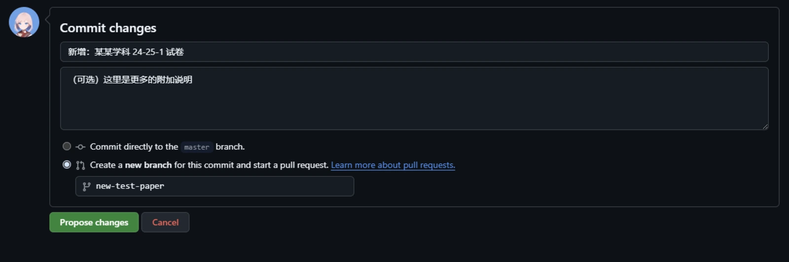

import { FileTree } from '@astrojs/starlight/components';

本文介绍了向本项目贡献资料的准则与方法。

## 资料形式

我们的初衷是方便同学们的期末复习，接受的资料的形式包括但不限于：

- :white_check_mark: 考试试卷
- :white_check_mark: 复习 PPT
- :white_check_mark: 习题 & 解答
- :white_check_mark: 课件
- :white_check_mark: 选课 / 考试攻略

但是，我们**不接受**以下形式的资料：

- :x: 电子版书籍、教材，我们认为这些内容会对版权产生侵犯。
- :x: 课程实验代码，我们认为这些内容需要学生自己探索。
- :x: 超过 100M 的单个文件，因为本项目没有启用 `git-lfs`。

## 资料格式

我们建议的资料格式为 PDF 和 [Markdown](https://markdown.com.cn/)。这样的资料可以直接在线预览，也方便其他同学在线查看。如果您的资料是其他格式，我们建议您将其转换为 PDF 或 Markdown 格式。

对于 PowerPoint 演示文稿、Word 文档等格式的资料，您可以使用以下方法转换为 PDF 格式：

- 使用 Microsoft Office 或 WPS Office 等办公软件，导出为 PDF 格式
- 使用 Adobe Acrobat 等 PDF 编辑软件，将其另存为 PDF 格式
- 使用 [扫描全能王](https://www.camscanner.com/)
- 使用 [HiPDF](https://www.hipdf.cn/)
- 使用 [iLovePDF](https://www.ilovepdf.com/)
- 使用 [PDF365](https://www.pdf365.cn/)

在转换完成后，您还应该对其进行压缩，以减少文件大小。上面提供的 HiPDF、iLovePDF 等平台就提供了压缩功能。如果您偏好使用命令行工具，您可以使用 [`theeko74/pdfc`](https://github.com/theeko74/pdfc)。

## 资料存放与命名

您应该参考[《资料分类说明》](/guides/categories)，将资料存放到正确的仓库中。在存放资料时，您应当对资料进行适当的重命名：

- 使用 `第1章-1-课程介绍` 代替 `第一章-1-课程介绍` 有利于资料的自动排序；
- 在您能确定一份资料的时间信息时，为资料添加适当的后缀（特别是针对试卷），例如使用 `21-22-1` 表示它是 `2021-2022 学年第 1 学期` 的资料（考虑到长度，不再推荐使用 `2021-2022-1` 这样的形式）。

我们希望分类存放资料，以便同学们更快地找到自己需要的资料。一个好的习惯是，将课件、复习资料、试卷等不同类型的资料放在不同的文件夹下。

**特别地**，对于 [`NJUPT-General-Free-Exams`](https://github.com/NJUPTFreeExams/NJUPT-General-Free-Exams) 通识课资料仓库，请遵循下面的规则：

- 对于非 Markdown 格式的资料，您应该将其放入 `/public/` 目录下的相应子目录下。举例而言，如果您希望贡献 “毛概” 这门课的 2024 年的复习资料及期末试卷，可能的目录结构如下：

<FileTree>
- public
  - 毛概
    - 2018/
    - 2021/
    - 2022/
    - 2024
      - **课件及复习资料/**
      - **期末试卷/**
</FileTree>

- 如果您希望贡献的资料是 Markdown 格式的，我们建议您将其放入 `/src/content/docs/reserved/` 目录下。这样，您的资料将直接显示在门户网站上。

关于 [`NJUPT-General-Free-Exams`](https://github.com/NJUPTFreeExams/NJUPT-General-Free-Exams) 的更多信息，请参考[《关于 NJUPT-General-Free-Exams 的特别说明》](/guides/about-general)。

:::note
为了使本门户网站能识别您的资料，您**必须**为您的 Markdown 文件添加 YAML 头部（Frontmatter），以提供更多的信息。例如：

```markdown
---
title: 文件标题（必选）
description: 内容描述（可选）
---
```

:::

## 提起拉取请求（PR）

为了向仓库贡献资料，您需要首先 Fork 相应的仓库，对其做出更改并推送（Push），然后，发起一个拉取请求（Pull Request），请求我们拉取（Pull）您的更改内容。

下面是一个在 GitHub 网站进行操作的完整示例：

1. 前往您想要贡献的仓库首页，点击右上角的 `Fork` 按钮，在下一个页面点击右下角的 `Create fork` 按钮。如果您已经进行过此操作，那么您应该点击右上角的头像，在下拉栏中点击 `Your repositories`，之后找到并点击相应的仓库。页面会自动跳转到 Fork 后的仓库，您应该在左上角看到 `forked from ...` 字样。
2. 打开想要上传到的文件夹，点击右上角的 `Add file`，在下拉栏中选择 `Upload files`。
3. 将想要上传的 **经过压缩的** 文件或文件夹拖入页面中央的方框内，并等待上传完成。
4. 在 `Commit changes` 卡片内，填写您的提交说明，可选地，您还可以附加更多说明。在最下方，选择 `Create a new branch for this commit and start a pull a request`，并在下方填入一个使用英文和 `-` 符号写出的具有描述性的名称。



6. 在下一个页面，参考 [`NJUPT-General-Free-Exams #34`](https://github.com/NJUPTFreeExams/NJUPT-General-Free-Exams/pull/34) 或 [`NJUPT-CST-Free-Exams #22`](https://github.com/NJUPTFreeExams/NJUPT-CST-Free-Exams/pull/22) 描述您此次贡献的内容。

您也可以参考（将文章中的 “代码” 理解为您希望贡献的文件即可）：

- [为一个开源项目贡献代码 | 简明 GitHub 教程 | BlockLune's Blog](https://blocklune.cc/zh/posts/simple-github-tutorial/#%E4%B8%BA%E4%B8%80%E4%B8%AA%E5%BC%80%E6%BA%90%E9%A1%B9%E7%9B%AE%E8%B4%A1%E7%8C%AE%E4%BB%A3%E7%A0%81)

为了更好地协作，我们建议您开启 “[允许维护员编辑](https://docs.github.com/zh/pull-requests/collaborating-with-pull-requests/working-with-forks/allowing-changes-to-a-pull-request-branch-created-from-a-fork)”，这样，我们就可以直接修改您的 PR。

## 高级贡献

:::important
此部分内容涉及更高级的主题。如果您正在进行的贡献仅仅是添加一些文件，那么您**无需**阅读这一部分。
:::

为了进行诸如“整理修改当前已有文件”、“修改此门户网站本身”等贡献内容，上述使用 GitHub 网页版进行操作的方法可能不能完全满足您的要求。此时，您可能就需要将您 Fork 得到的仓库克隆（Clone）下来，在**本地**进行完您的操作后，再推送（Push）到 GitHub，然后再进行提起拉去请求中的后续操作。

由于我们的仓库含有大量资料，仓库体积庞大，且[没有采用 submodule 或 subtree (#6)](https://github.com/NJUPTFreeExams/NJUPT-General-Free-Exams/issues/6)，所以常规的克隆操作可能会浪费大量的时间和空间。以下两种方法可以帮助您在一定程度上缓解这些问题：

### 浅克隆（Shallow Clone）

默认情况下，`git clone` 命令会获取完整的提交历史。但通过使用 `--depth=1` 选项，可指定 `git` 只克隆最近的提交历史，实现所谓的 “浅克隆（Shallow Clone）”。

举例而言，为了浅克隆当前仓库，您可以运行：

```bash
git clone --depth=1 git@github.com:NJUPTFreeExams/NJUPT-General-Free-Exams.git
```

### 稀疏检出（Sparse Checkout）

`git` 的 [`sparse-checkout`（稀疏检出）](https://git-scm.com/docs/git-sparse-checkout) 功能允许您将工作区只包含全部文件的子集。借助该功能，我们可以只克隆部分子目录的内容。

举例而言，如果您希望为该门户网站本身做出贡献，您可能并不需要 `public/` 目录，而只需要 `src/` 目录。那么您可以这样做：

```bash
git clone --filter=blob:none --sparse git@github.com:NJUPTFreeExams/NJUPT-General-Free-Exams.git  # 这会克隆下来根目录中的所有文件，但不包括子目录
cd NJUPT-General-Free-Exams/
git sparse-checkout set src/  # 这会克隆下来根目录下的 `src/` 子目录
```

以下是 `sparse-checkout` 的常用功能说明：

| 命令                              | 作用                                |
| --------------------------------- | ----------------------------------- |
| git sparse-checkout set DIR1 DIR2 | 设置要检出的目录为 `DIR1` 和 `DIR2` |
| git sparse-checkout add DIR       | 新增一个目录（`DIR`）到检出列表     |
| git sparse-checkout reapply       | 重新应用当前规则（目录变更后刷新）  |
| git sparse-checkout disable       | 关闭稀疏检出，恢复完整检出          |
| git sparse-checkout list          | 查看当前稀疏检出规则                |
