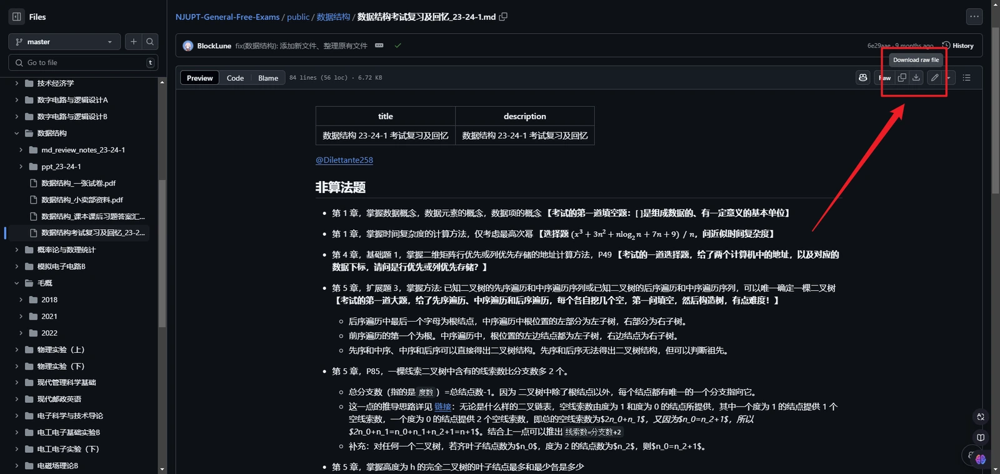
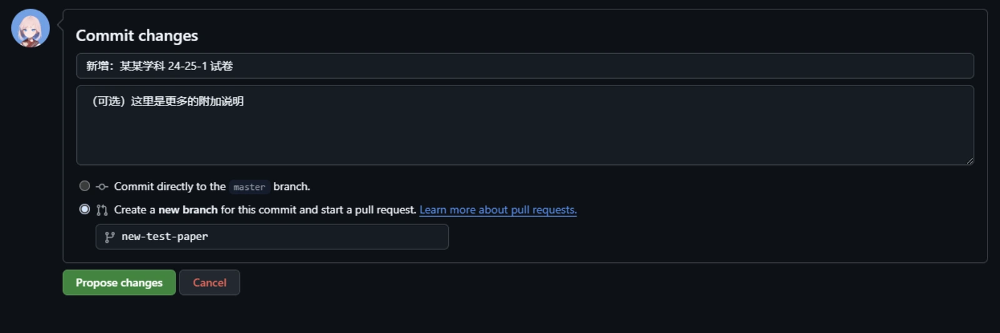

import { FileTree } from '@astrojs/starlight/components';

[NJUPTFreeExams](https://github.com/NJUPTFreeExams) 是由 **南京邮电大学** 计算机学院学生建立的一个 GitHub 组织，旨在收集校内历年资料造福后人。

本组织及相关项目受到 [`浙江大学课程攻略共享计划`](https://github.com/QSCTech/zju-icicles) 和 [`清华大学计算机系课程攻略`](https://github.com/PKUanonym/REKCARC-TSC-UHT) 等项目的启发，在这里向他们表示感谢。

## 说明

1. **本组织收集整理的资料仅供个人学习交流使用，请在下载后 24 小时内删除。严禁删改、二传，或用作商业用途！如有侵权，请及时与我们联系。**
2. 资料仅供参考，请自行判断适用性。
3. 取决于资料的格式及其贡献方法，您可以以在线或下载的方式查看贡献者们贡献的资料，具体请见[检索及下载指南](#检索及下载指南)。
4. 部分资料已经有些年头，如果大家手头有更好的资料，欢迎[提交拉取请求（Pull Request, PR）](https://github.com/NJUPTFreeExams/NJUPT-General-Free-Exams/compare)，具体请见[贡献指南](#贡献指南)。
5. 如果您发现资料存在问题，或者对于本项目有任何改进建议，请[提交议题（Issue）](https://github.com/NJUPTFreeExams/NJUPT-General-Free-Exams/issues/new/choose)，具体请见[议题提交指南](#议题提交指南)。
6. 如果觉得本仓库有用，请在 GitHub 上为我们点个:star:！来自大家的关注、维护和贡献，才是让这个资料集继续存在的核心动力:smiling_face_with_three_hearts:。

## 资料分类

本组织根据资料的种类，将资料分类存放在不同的仓库下：

- 通识课资料：[`NJUPT-General-Free-Exams`](https://github.com/NJUPTFreeExams/NJUPT-General-Free-Exams)
- 计算机相关专业资料：[`NJUPT-CS-FREE`](https://github.com/NJUPTFreeExams/NJUPT-CS-FREE)
- 自动化专业资料：[`NJUPT-AUTO-Free-Exams`](https://github.com/NJUPTFreeExams/NJUPT-AUTO-Free-Exams)
- 材料专业资料：[`NJUPT-IAM-FREE-Exams`](https://github.com/NJUPTFreeExams/NJUPT-IAM-FREE-Exams)
- 管理专业资料：[`NJUPT-Managing-Free-Exams`](https://github.com/NJUPTFreeExams/NJUPT-Managing-Free-Exams)
- 通信工程专业资料：[`NJUPT-TE-Free-Exams`](https://github.com/NJUPTFreeExams/NJUPT-TE-Free-Exams)

如果您希望提交的资料无法分类到这些仓库中，请在通识课资料仓库中[提交议题（Issue）](https://github.com/NJUPTFreeExams/NJUPT-General-Free-Exams/issues/new/choose)。

## 检索及下载指南

由于资料仓库都位于 GitHub 上，所以您必须确保您能够访问 GitHub。为此，您可以尝试以下方法：

- 使用 **代理**（最为推荐的方法）
- 使用 [Watt Toolkit](https://steampp.net/) 本地反向代理加速 GitHub（操作见下图）
- 修改 hosts 文件（参考：[解决 GitHub 的 host 域名被限制的问题](https://iphysresearch.github.io/blog/post/programing/linux_shell/hosts/)）


除了通识课资料仓库外，到目前为止，其他资料仓库并未建立门户网站。这些未建立门户网站的资料仓库的目录结构相对简单，直接进入检索即可。

对于[通识课资料仓库](https://github.com/NJUPTFreeExams/NJUPT-General-Free-Exams)，由于此门户网站的建立，目录结构更为复杂。这是由于门户网站的网站代码也存储在了此仓库中。有效的资料分散于下面的目录中：

- `public/`
- `src/content/`

在您检索到您需要的资料后，您可以通过以下方式下载：

- 点击文件名，进入文件详情页，点击右上角的下载按钮进行下载（见下图）
- 点击文件名，进入文件详情页，复制网址，并前往 [GitHub Proxy](https://ghp.ci/) 粘贴地址进行下载



此外，您也可以使用 [Git](https://git-scm.com/)、任意 Git 客户端或任意 GitHub 下载工具进行下载。

关于 Git 和 GitHub 的使用方法，可以参考：

- [Git 教程 | 廖雪峰的官方网站](https://liaoxuefeng.com/books/git/introduction/index.html)
- [简明 Git 教程 | BlockLune's Blog](https://blocklune.cc/zh/posts/simple-git-tutorial/)
- [简明 GitHub 教程 | BlockLune's Blog](https://blocklune.cc/zh/posts/simple-github-tutorial/)

下面是一些 GitHub 的下载工具：

- [`github-directory-downloader`](https://github.com/Momo707577045/github-directory-downloader)
- [`DownGit`](https://github.com/MinhasKamal/DownGit)
- [`dclone`](https://github.com/ykfe/dclone)
- [`GitZip`](https://chromewebstore.google.com/detail/gitzip-for-github/ffabmkklhbepgcgfonabamgnfafbdlkn)

## 贡献指南

### 资料形式

我们的初衷是方便同学们的期末复习，接受的资料的形式包括但不限于：

- :white_check_mark: 考试试卷
- :white_check_mark: 复习 PPT
- :white_check_mark: 习题 & 解答
- :white_check_mark: 课件
- :white_check_mark: 选课 / 考试攻略

但是，我们**不接受**以下形式的资料：

- :x: 电子版书籍、教材，我们认为这些内容会对版权产生侵犯。
- :x: 课程实验代码，我们认为这些内容需要学生自己探索。
- :x: 超过 100M 的单个文件，因为本项目没有启用 `git-lfs`。

### 资料格式

我们建议的资料格式为 PDF 和 [Markdown](https://markdown.com.cn/)。这样的资料可以直接在线预览，也方便其他同学在线查看。如果您的资料是其他格式，我们建议您将其转换为 PDF 或 Markdown 格式。

对于 PowerPoint 演示文稿、Word 文档等格式的资料，您可以使用以下方法转换为 PDF 格式：

- 使用 Microsoft Office 或 WPS Office 等办公软件，导出为 PDF 格式
- 使用 Adobe Acrobat 等 PDF 编辑软件，将其另存为 PDF 格式
- 使用 [扫描全能王](https://www.camscanner.com/)
- 使用 [HiPDF](https://www.hipdf.cn/)
- 使用 [iLovePDF](https://www.ilovepdf.com/)
- 使用 [PDF365](https://www.pdf365.cn/)

在转换完成后，您还应该对其进行压缩，以减少文件大小。上面提供的 HiPDF、iLovePDF 等平台就提供了压缩功能。

### 资料命名与存放

您应当对资料进行适当的重命名：

- 使用 `第1章-1-课程介绍` 代替 `第一章-1-课程介绍` 有利于资料的自动排序；
- 在您能确定一份资料的时间信息时，为资料添加适当的后缀（特别是针对试卷），例如使用 `21-22-1` 表示它是 `2021-2022 学年第 1 学期` 的资料（考虑到长度，不再推荐使用 `2021-2022-1` 这样的形式）。

我们希望分类存放资料，以便同学们更快地找到自己需要的资料。一个好的习惯是，将课件、复习资料、试卷等不同类型的资料放在不同的文件夹下。

**特别地**，对于 [`NJUPT-General-Free-Exams`](https://github.com/NJUPTFreeExams/NJUPT-General-Free-Exams) 通识课资料仓库，请遵循下面的规则：

- 对于非 Markdown 格式的资料，您应该将其放入 `/public/` 目录下的相应子目录下。举例而言，如果您希望贡献 “毛概” 这门课的 2024 年的复习资料及期末试卷，可能的目录结构如下：

<FileTree>
- public
  - 毛概
    - 2018/
    - 2021/
    - 2022/
    - 2024
      - **课件及复习资料/**
      - **期末试卷/**
</FileTree>

- 如果您希望贡献的资料是 Markdown 格式的，我们建议您将其放入 `/src/content/docs/reserved/` 目录下。这样，您的资料将直接显示在门户网站上。

:::note
为了使本门户网站能识别您的资料，您**必须**为您的 Markdown 文件添加 YAML 头部（Frontmatter），以提供更多的信息。例如：

```markdown
---
title: 文件标题（必选）
description: 内容描述（可选）
---
```
:::

### 提起拉取请求（PR）

为了向仓库贡献资料，您需要首先 Fork 相应的仓库，对其做出更改并推送（Push），然后，发起一个拉取请求（Pull Request），请求我们拉取（Pull）您的更改内容。

下面是一个在 GitHub 网站进行操作的完整示例：

1. 前往您想要贡献的仓库首页，点击右上角的 `Fork` 按钮，在下一个页面点击右下角的 `Create fork` 按钮。如果您已经进行过此操作，那么您应该点击右上角的头像，在下拉栏中点击 `Your repositories`，之后找到并点击相应的仓库。页面会自动跳转到 Fork 后的仓库，您应该在左上角看到 `forked from ...` 字样。
3. 打开想要上传到的文件夹，点击右上角的 `Add file`，在下拉栏中选择 `Upload files`。
4. 将想要上传的 **经过压缩的** 文件或文件夹拖入页面中央的方框内，并等待上传完成。
5. 在 `Commit changes` 卡片内，填写您的提交说明，可选地，您还可以附加更多说明。在最下方，选择 `Create a new branch for this commit and start a pull a request`，并在下方填入一个使用英文和 `-` 符号写出的具有描述性的名称。



6. 在下一个页面，参考 [`更新 JAVA 程序设计 （2021-08） #22`](https://github.com/NJUPTFreeExams/NJUPT-CS-Free-Exams/pull/22) 描述您此次贡献的内容。

您也可以参考（将文章中的 “代码” 理解为您希望贡献的文件即可）：

- [为一个开源项目贡献代码 | 简明 GitHub 教程 | BlockLune's Blog](https://blocklune.cc/zh/posts/simple-github-tutorial/#%E4%B8%BA%E4%B8%80%E4%B8%AA%E5%BC%80%E6%BA%90%E9%A1%B9%E7%9B%AE%E8%B4%A1%E7%8C%AE%E4%BB%A3%E7%A0%81)

## 议题提交指南

按照下面的步骤，以提交一个议题，指出问题或提出更改意见：

1. 前往您想要提交议题的仓库首页，点击上方的 `Issues` 按钮。
2. 在下个页面，点击右侧绿色的 `New issue` 按钮。
3. 在下个页面，填写标题和描述。

标题应该简洁清晰地概括问题，描述则应该细致地描述您的问题，可以参考 [`FIX: 文件 / 计算机通信与网络 / 2017-2018-2.pdf 中可能存在内容错误`](https://github.com/NJUPTFreeExams/NJUPT-CS-Free-Exams/issues/20)。
